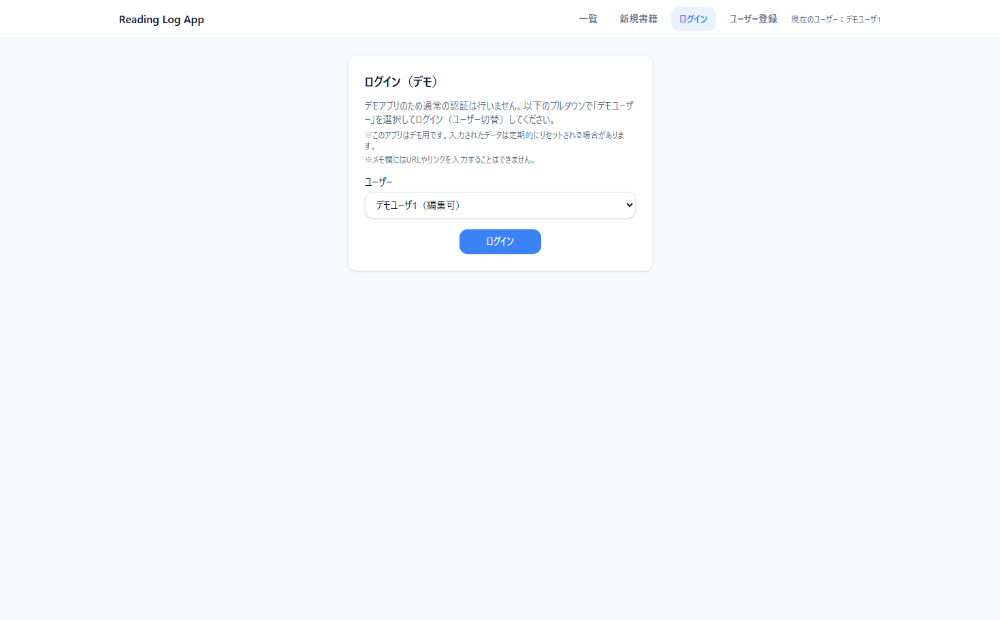
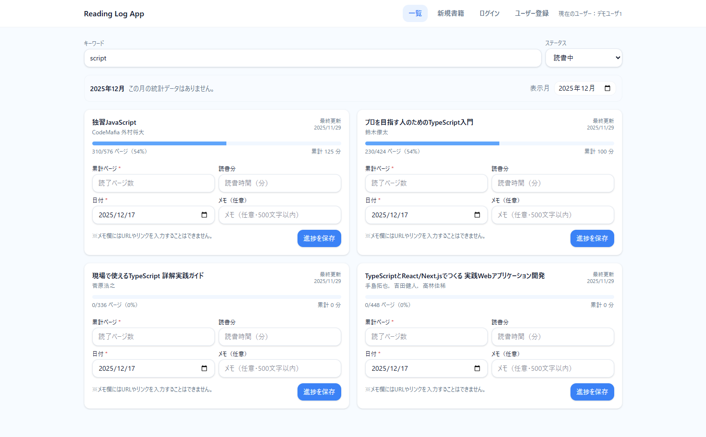
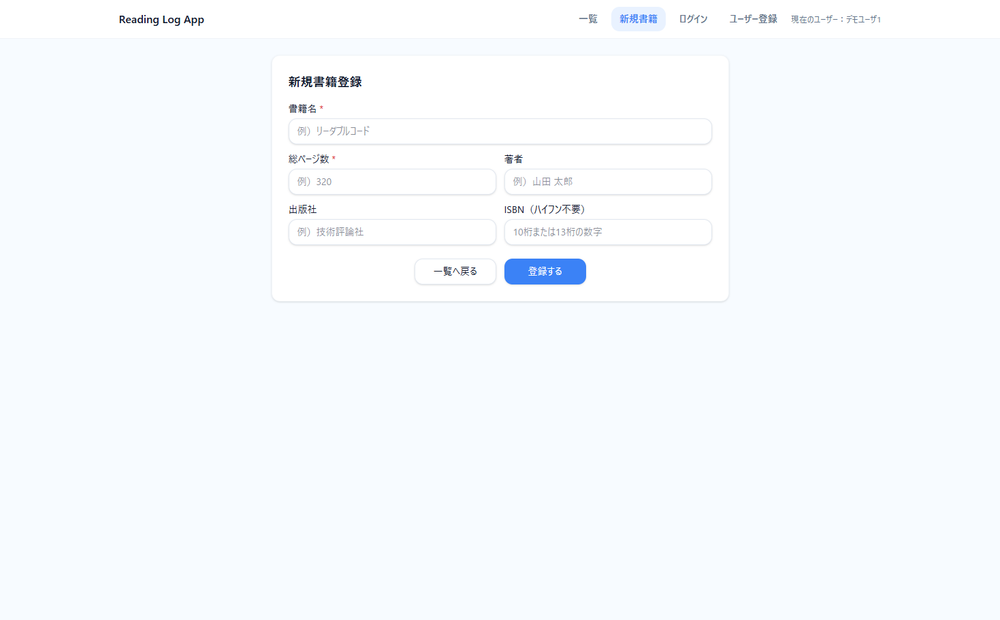
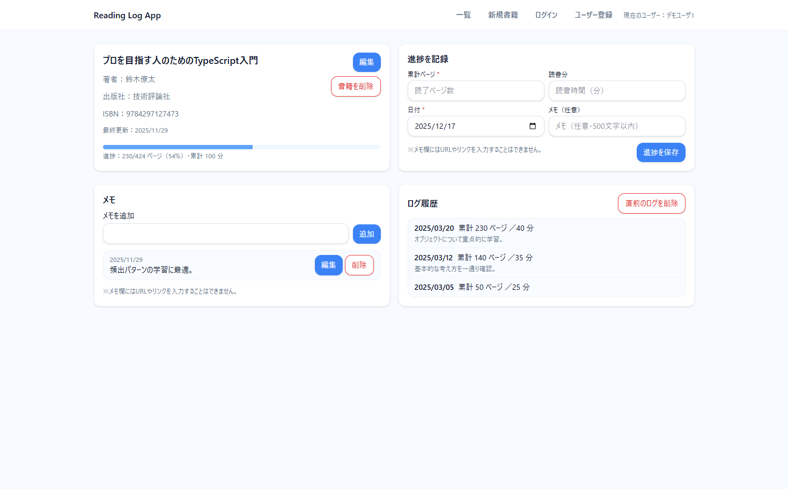
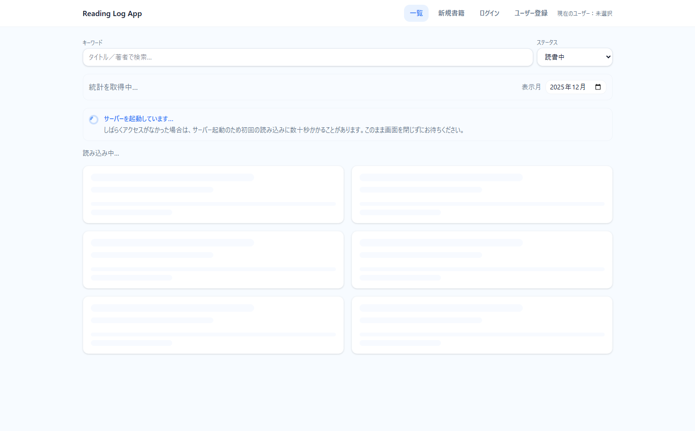

# 読書記録アプリ（reading-log-app）

  

  
  
  
  
  

  
  
  
  

読書中の書籍を登録し、**累計ページ**をベースに読書ログを追加して進捗管理できるアプリです。  
メモ（Notes）や月次統計（Stats）にも対応しています。

> 本アプリは **デモ運用**を前提としており、認証は行いません（デモユーザー切替方式）。

---

## デモURL

- [`アプリURL`](https://reading-log-app-frontend.vercel.app/)（Vercel）：`https://reading-log-app-frontend.vercel.app/`

- [`バックエンドのヘルスチェック`](https://reading-log-app-backend.onrender.com/health)（Render）

> Render の環境では、一定時間アクセスがないと **コールドスタート**が発生し、初回表示に時間がかかる場合があります。  
> 本アプリでは「サーバ起動待ちの可能性」をローディングUI上で説明表示します。

---

## スクリーンショット

1. ログイン（デモユーザー選択）  
   

2. 書籍一覧（検索・絞り込み / 統計表示）  
   

3. 書籍新規登録  
   

4. 書籍詳細（編集 / 進捗追加 / 直近ログ削除 / メモ / ログ履歴）  
   

5. ローディング（サーバ起動待ちの説明表示）  
   

---

## できること

- 書籍の登録 / 編集 / 論理削除
- 読書ログの追加（累計ページ・読書時間・日付・メモ）
- 直近ログの取り消し
- メモの追加 / 編集 / 削除
- 月次統計（合計ページ / 1日平均）
- ローディング・エラー体験の整備（コールドスタート考慮）

---

## 技術スタック

- Frontend: JavaScript / Vite / React / Tailwind CSS
- Backend: JavaScript / Node.js / Express
- DB: Vercel Postgres
- Data Access: ORM を使わず 生SQL + Repository構成
- Hosting：Vercel（FE）/ Render（BE）

---

## アプリの特徴

- **生SQL + Repository 構成**で責務分離
- **サーバ／フロントの二段バリデーション**
- 読書ログの **Undo（直近ログ削除）** と、それに伴う集計値の整合性維持
- Render コールドスタートを前提にした **段階的ローディングUI**（一定時間経過で説明を追加）
- デモ運用のため、ユーザー識別は **`X-Demo-User` ヘッダ**で実現（ログイン画面で切替）
